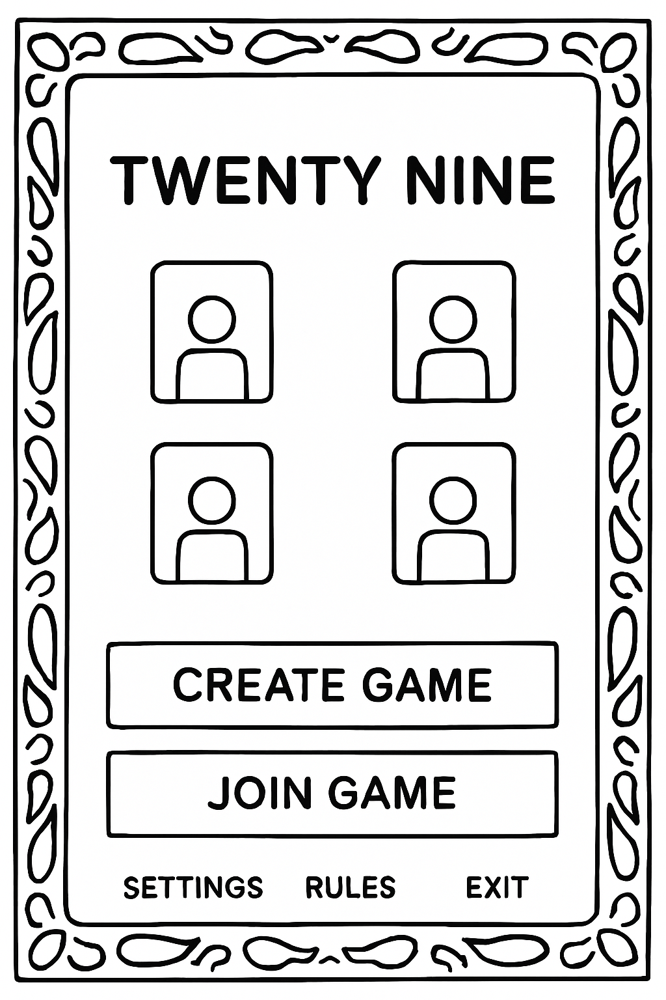
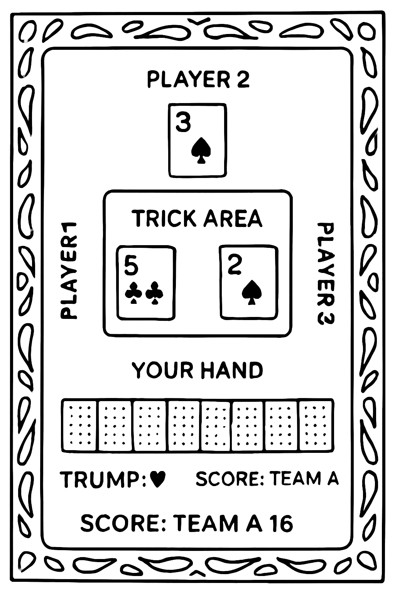
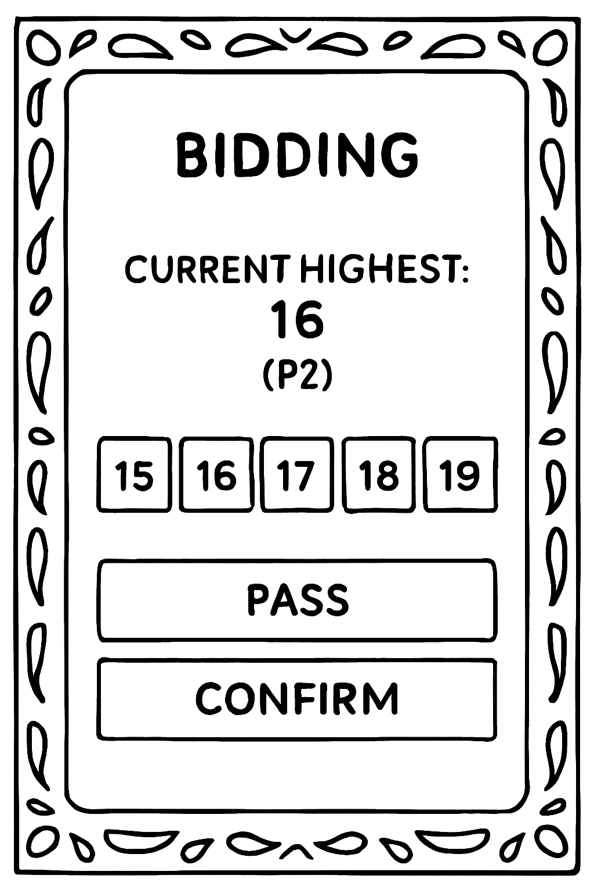
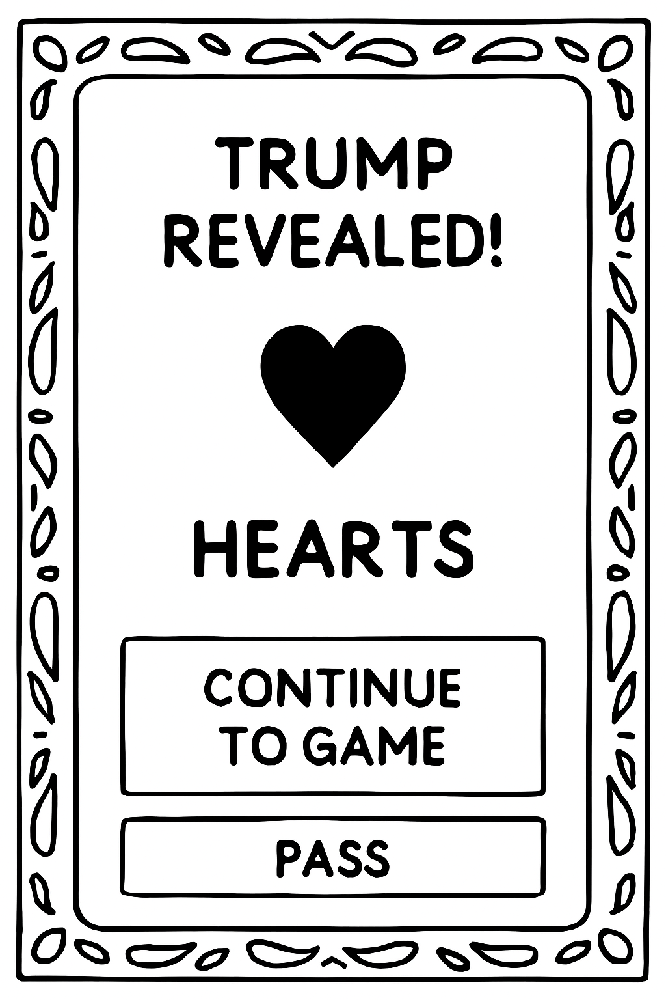
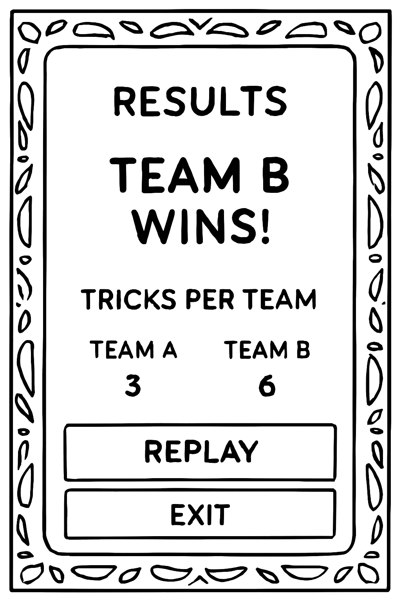

"# Phase 3 Wireframes" 
## Lobby Screen
- Shows player avatars
- Buttons: Create Game, Join Game
- Placeholder for cultural motif background

### Sketch

### Notes
- Avatars arranged in a circle (4 players max)
- Cultural motif: subtle paisley border
- Buttons centered at the bottom
---

## Game Table Screen
- Displays cards for each player
- Score area and trump indicator
- Trick area in the center

### Sketch

### Notes
- Four player positions around the table
- Cards face up for current trick
- Trump suit shown clearly at top
- Scoreboard visible on one side

---

## Bidding Modal
- Popup for bidding interaction
- Options for bid values
- Confirm and cancel buttons

### Sketch

### Notes
- Simple, centered modal
- Large buttons for bid values
- Highlight current highest bid
- Clear confirm/cancel actions

---

## Trump Reveal Screen
- Dramatic reveal of trump suit
- Placeholder for animation
- Continue button to return to game

### Sketch

### Notes
- Trump suit shown large in center
- Background glow or cultural motif
- Smooth transition back to table
- Optional sound effect placeholder

---

## Results Screen
- Shows scores and tricks won
- Replay and exit buttons
- Space for achievements or highlights

### Sketch

### Notes
- Clear win/lose message
- Trick count per team
- Buttons at bottom for replay/exit
- Placeholder for achievements or stats